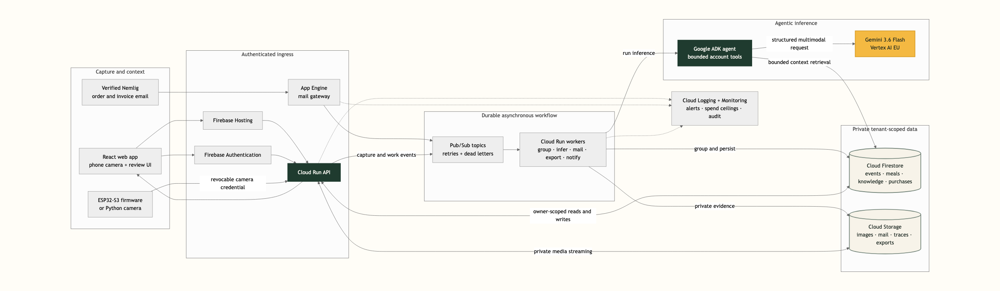

# Gemini FoodLog production architecture

This is the judge-facing architecture diagram for the deployed MVP. Solid arrows
are application data flows. Dashed arrows are operational telemetry. The public
Cloud Run API accepts internet transport, but every application route except
`/health` derives its account from a verified Firebase ID token or a revocable
`FoodLogCamera` credential. Browser clients never receive direct Firestore or
Cloud Storage access.

The upload-ready PNG is rendered from the source-controlled
[`architecture-diagram.mmd`](architecture-diagram.mmd) file. Regenerate it with
`npm run render:architecture` before submission whenever the source changes.

## Trust and isolation invariants

- The application account is the tenant boundary. Account IDs come from trusted
  authentication or server-side event state, never from a client-selected path.
- Firebase users and browser cameras enter only through the API. Device clients use
  independently revocable, hashed camera credentials. Firestore Security Rules deny
  all direct client reads and writes.
- Pub/Sub invokes internal-only workers with Google-signed OIDC tokens. Separate image
  subscriptions make grouping and inference independently retryable; every stream has
  a retained dead-letter path.
- Media, raw mail, traces, and exports have uniform bucket-level access and public
  access prevention. Object keys are server-derived and account-scoped. The export
  bucket deletes live objects after one day.
- Only the worker identity can invoke Vertex AI. Gemini receives the bounded evidence
  selected for one account and the application persists a private, redacted trace.

## Arrow-to-implementation audit

| Diagram flow | Source-controlled implementation evidence |
| --- | --- |
| Firebase Hosting and Authentication to the React app and API | [`firebase.tf`](../infra/terraform/production/firebase.tf), [`firebase.ts`](../apps/web/src/firebase.ts), and [`api.ts`](../apps/web/src/api.ts) define the hosted identity and ID-token transport. |
| Browser and device capture to API, Firestore, media, and image events | [`app.py`](../services/backend/src/foodlog_backend/app.py), [`image_events.py`](../services/backend/src/foodlog_backend/image_events.py), [`cloud_run.tf`](../infra/terraform/production/cloud_run.tf), and the [capture contract](capture-api-v1.md) implement both authenticated upload paths and the durable handoff. |
| Image-topic fan-out to grouping and inference | [`pubsub.tf`](../infra/terraform/production/pubsub.tf) defines two durable subscriptions on the same image topic, OIDC push, retry, and dead-letter policies; [`cloud_run.tf`](../infra/terraform/production/cloud_run.tf) defines both internal-only workers. |
| Inference through Google ADK and Gemini on Vertex AI | [`agent.py`](../services/backend/src/foodlog_agent/agent.py), [`event_reasoning.py`](../services/backend/src/foodlog_agent/event_reasoning.py), and [`cloud_run.tf`](../infra/terraform/production/cloud_run.tf) fix the ADK runtime, bounded tools, `gemini-3.6-flash`, Vertex AI, and the `eu` location. |
| Nemlig email through App Engine, raw storage, Pub/Sub, and purchase worker | [`app.yaml`](../services/mail-gateway/app.yaml), [`main.py`](../services/mail-gateway/main.py), [`pubsub.tf`](../infra/terraform/production/pubsub.tf), and the [verified classification contract](nemlig-mail-classification-v1.md) define the complete inbound path. |
| Export request, private evidence reads, and temporary archive | [`account_export_events.py`](../services/backend/src/foodlog_backend/account_export_events.py), [`cloud_run.tf`](../infra/terraform/production/cloud_run.tf), and [`storage.tf`](../infra/terraform/production/storage.tf) define the queue, worker access, authenticated API retrieval, and one-day object lifecycle. |
| Account-created notification to Pushover | [`notifications.py`](../services/backend/src/foodlog_backend/notifications.py), [`pubsub.tf`](../infra/terraform/production/pubsub.tf), [`cloud_run.tf`](../infra/terraform/production/cloud_run.tf), and [`secrets.tf`](../infra/terraform/production/secrets.tf) define the event, OIDC worker, and Secret Manager-backed delivery. |
| Tenant storage and service identity boundaries | [`firestore.rules`](../infra/firestore/firestore.rules), [`firestore-schema-v1.md`](firestore-schema-v1.md), [`identities.tf`](../infra/terraform/production/identities.tf), and [`storage.tf`](../infra/terraform/production/storage.tf) define default-deny clients, account paths, least-privilege runtime identities, and private buckets. |
| Logs, metrics, dashboard, alerts, and budget | [`monitoring.tf`](../infra/terraform/production/monitoring.tf), [`monitoring_dashboard.tf`](../infra/terraform/production/monitoring_dashboard.tf), [`monitoring_alerts.tf`](../infra/terraform/production/monitoring_alerts.tf), and the [operations guide](observability.md) define the operational path. |

The live deployment evidence, including resource revisions, immutable image digests,
negative tenant checks, model traces, and zero-drift Terraform reads, is retained on
the corresponding completed tickets in the [MVP backlog](mvp-backlog.html).
