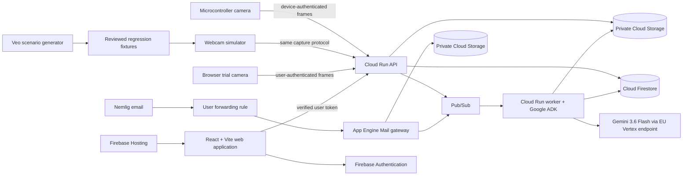

# Gemini FoodLog MVP architecture

- **Status:** Working architecture and decision record
- **Last updated:** 2026-08-25
- **Source concept:** [CORE_IDEA.md](../CORE_IDEA.md) preserves the original proposal verbatim.
- **Deferred work:** [post-hackathon-backlog.md](post-hackathon-backlog.md) is the canonical post-hackathon list.
- **Credit expiry:** [credit-expiry-runbook.md](credit-expiry-runbook.md) records the zero-out-of-pocket shutdown boundary.
- **Build status:** [mvp-backlog.html](mvp-backlog.html) is the source-controlled task order and evidence gate board.

This document records the MVP decisions made so far, the reasons behind them, and the details that remain open. It is deliberately more specific than the project-level instructions. Implementation status is called out explicitly; planned sections are not deployment claims.

## 1. Product boundary

Gemini FoodLog is a passive, household-specific food journal. A kitchen camera captures ordinary, unstaged activity; an agent combines the visual event with recent purchases and learned household context; the system records its best interpretation and asks focused questions when ambiguity matters.

The primary goal is to create a useful longitudinal food record for later symptom investigation. Calorie and macronutrient estimation are secondary.

The hackathon MVP implements the food journal only. Symptom entry, symptom-source integrations, and food/symptom association analysis are explicitly deferred.

### 1.1 MVP assumptions

- The household must not stage ingredients, scan packages, photograph plates, or announce meals.
- For the MVP household, food that is visibly prepared may be treated as food eaten shortly afterward. The system does not implement a separate consumption-confirmation workflow.
- The MVP does not capture symptoms or claim to identify symptom associations.
- A preparation event produces a shared household meal. The MVP does not resolve meals into separate histories for individual household members.
- Reheating leftovers is another observable preparation event and can therefore produce a meal entry.
- An account may have one or more cameras, although the main demonstration only needs one physical camera.
- The MVP is genuinely multi-user: test accounts and real accounts must be isolated even if the public demonstration focuses on one household.
- Accepted images are retained indefinitely during the prototype. A fixed retention policy will be added later; the duration has not been selected.

### 1.2 What the MVP must demonstrate

The smallest convincing end-to-end story is:

1. A physical camera or webcam simulator observes ordinary kitchen activity.
2. The client uploads an activity sequence without the user doing anything.
3. The backend securely stores and groups the frames.
4. The agent inspects the event and retrieves relevant account-scoped context.
5. It records a meal with confidence, alternatives, evidence, and an understandable rationale.
6. If uncertainty matters, it logs the best guess provisionally and may ask a narrow, evidence-backed question on that event without blocking the journal.
7. The user confirms or corrects the result in the web UI.
8. The meal and household knowledge are revised without erasing the original evidence or feedback.
9. A later similar event benefits from that learning.
10. After enough history exists, the agent may surface a specific pattern hypothesis with supporting examples for the user to confirm or correct.

### 1.3 Planned production slice

The first durable production vertical slice is browser-to-journal:

1. A verified owner signs in to a real application account with its trial entitlement.
2. The browser obtains webcam permission and creates an account-scoped browser-camera session.
3. The real ingestion API accepts an authenticated frame, reserves quota idempotently, stores the private image, and publishes processing work.
4. The real worker assembles one event, invokes Gemini through Vertex AI, validates the structured result, and persists the inference and full trace.
5. The web application displays the resulting journal entry with its image, confidence, evidence, and processing status.

This slice uses the production contracts and tenant boundary. It is not a throwaway manual-upload endpoint. The first iteration may exercise a single browser event before local motion grouping is calibrated, but the browser capture component and ingestion path remain the ones extended for motion bursts. Corrections and learning, purchase email, richer event grouping, and physical firmware follow once this spine works on deployed GCP.

### 1.4 Current implementation checkpoint

As of 2026-08-25, the repository has a deliberately zero-model-cost implementation checkpoint plus a separately deployed historical preview:

- a Firebase-authenticated React/Vite application with a protected standalone manual camera route and journal display;
- one shared FastAPI capture endpoint for browser, simulator, and physical clients, with Firebase or revocable device authentication, a 25-account cap, a 200-image trial quota, strict versioned metadata, idempotent durable capture acceptance, content validation, and authorization-checked image access;
- production Firestore and private Cloud Storage adapters plus concurrency-safe in-memory test adapters;
- immutable meal revisions, raw idempotent confirmation/correction records, and tenant-scoped clarification questions whose answers revise the original meal instead of creating a duplicate;
- a prototype clarification inbox, meal feedback controls, and revision history in the web application; the generic standalone inbox is rejected UX and is not the production design;
- tenant-isolation, retry/rollback, quota, content-validation, feedback, question, and deterministic domain tests;
- a Google ADK `Agent` and `App` definition that is imported in tests without calling a model;
- six immutable synthetic still-image fixtures generated with OpenAI image generation, not Veo: three deterministic ground-truth frames and three degraded distant-camera ambiguity tests.

Application ingestion never maps fixture hashes to results and has no in-process inference hook. Deterministic tests seed their known inference result explicitly after exercising the same shared capture endpoint. Real processing will occur only through the durable worker and Gemini path described below. Production startup fails closed without the configured GCP storage and Firebase identity settings.

Commit `ada2235` remains deployed as the private historical Cloud Run service `foodlog-preview-api` in `europe-west1`. It uses IAM plus a Secret Manager application secret, a dedicated runtime identity, zero minimum instances, and a one-instance maximum. Its authenticated smoke test created one ephemeral test account and camera, accepted two OpenAI-generated synthetic fixtures, produced the expected confident steak and chicken journal entries, and returned the stored private image bytes exactly. Cloud Logging showed no server errors. That isolated old revision still uses volatile preview state; its legacy upload route has been removed from the current application and generated OpenAPI and it is not the durable production slice.

The dedicated Google Cloud project `gemini-foodlog-2026` is the only project linked to the dedicated `Gemini FoodLog Hackathon` billing account. The promotion is active with DKK 984.25 remaining and expires on 2026-09-24. A DKK 400 monthly gross-spend budget alerts at 25%, 50%, and 75% (DKK 100, 200, and 300); it excludes credits when measuring spend so the warning still works while the promotion pays the bill. No model call has been made, and the unrelated local gcloud default remains `ffutils`. Exact live identifiers and evidence are recorded in `infra/preview/README.md`.

## 2. System shape

The repository has three product areas:

1. **Capture clients** — physical microcontroller firmware, a zero-install browser webcam mode for public trials, and a Python webcam simulator for reproducible testing, with possible phone clients later.
2. **Google Cloud backend** — ingestion, storage, event processing, agent orchestration, purchase-email ingestion, knowledge, quotas, and authorization.
3. **Web application** — journal, evidence, questions, feedback, household knowledge, cameras, account data, and usage state.

The three areas do not imply exactly three packages or deployable processes. The backend can contain separately deployable services where isolation or runtime requirements justify them.

### 2.1 Planned implementation languages

- **Backend and agent orchestration:** Python.
- **Web application:** TypeScript with React and Vite.
- **Physical firmware:** the language required by the selected microcontroller toolchain, expected to be C or C++.
- **Webcam simulator:** Python.
- **Cross-language contracts:** generated OpenAPI and JSON Schema artifacts rather than manually duplicated types.

### 2.2 Initial monorepo layout

This is a starting layout, not a commitment to create empty packages before they are used:

```text
apps/
  web/                    user-facing application and browser trial capture
clients/
  camera-firmware/        physical microcontroller client
  webcam-simulator/       reproducible Python capture client
services/
  backend/                current API, domain core, local adapters, and ADK definition
  api/                    future separately deployable ingestion and user API
  worker/                 future asynchronous event and agent processing
  mail-gateway/           future App Engine inbound-email adapter
packages/
  contracts/              generated API schemas and client types
tests/
  fixtures/               reviewed image/video scenarios and ground truth
  integration/            deployed and local end-to-end checks
```

Packages should only be created when the implementation needs them. Unused scaffolding is not part of the MVP.

### 2.3 Infrastructure as code

GCP infrastructure is provisioned with Terraform Community Edition from the start. The project does not depend on paid HCP Terraform.

Terraform state is stored in a dedicated private GCS bucket with object versioning and state locking. The state bucket is created through a small, documented bootstrap step because Terraform cannot use a backend bucket before it exists. State files, saved plans, local variable files containing secrets, and the `.terraform` working directory must not be committed.

The Terraform configuration must make the selected region, enabled APIs, service identities, least-privilege IAM, storage lifecycle settings, budget controls, and deployed services reviewable. Application releases may use a separate build/deploy workflow; Terraform owns cloud resources and configuration boundaries rather than rebuilding containers on every infrastructure change.

### 2.4 Continuous integration and deployment

GitHub Actions runs CI and production deployment. Google Cloud authentication uses GitHub's OpenID Connect token with Workload Identity Federation; no long-lived Google service-account key is stored in GitHub.

The trust relationship must be restricted to this repository and the intended protected branch or production environment. Pull-request jobs—including jobs triggered from forks—may lint, type-check, test, validate Terraform, and build artifacts, but they cannot obtain production credentials or apply infrastructure. Workflow permissions default to read-only and grant `id-token: write` only to the jobs that actually authenticate to Google Cloud.

Production changes have a deliberate approval boundary:

1. CI passes for the exact commit.
2. A production workflow is started from the protected `main` branch.
3. The GitHub `production` environment requires approval before its credential-bearing job can run. Repository visibility and GitHub plan support for required reviewers must be confirmed when the repository is configured.
4. Terraform applies use a narrowly scoped infrastructure identity; application deployments use a separate narrowly scoped deployment identity. Neither identity is available to ordinary pull-request jobs.
5. The pipeline deploys immutable artifacts identified by commit and digest, then runs authenticated health and smoke checks against the deployed revision. A successful command without a successful post-deployment check is not considered a verified release.

Terraform plans can contain sensitive values. Full plan artifacts and output are restricted to trusted runs and are not copied wholesale into public pull-request comments. Production deployments use a concurrency guard so two releases cannot mutate the same environment simultaneously.

## 3. Architecture overview



The application account is the tenant boundary. Every camera, image, email, purchase, event, meal, question, feedback item, wiki page, and usage record belongs to exactly one account.

### 3.1 Deployment locality

The MVP keeps application data and model processing in Europe. Cloud Run, Cloud Storage, and Gemini processing use Belgium (`europe-west1`). App Engine uses its corresponding `europe-west` location. The default Cloud Firestore database uses the EU multi-region (`eur3`), whose read-write regions are Belgium and the Netherlands and whose witness region is Finland. Gemini calls use a regional EU Vertex AI endpoint rather than the global endpoint. The exact Gemini 3.6 Flash regional model identifier and availability must be verified during provisioning before infrastructure is locked, because model availability is location-specific.

This is a privacy decision, even though it means using Gemini 3.6 Flash instead of the newer Gemini 3.7 Flash while 3.7 is only available through a global endpoint. App Engine and the default Firestore database share an immutable location dependency, so Terraform must provision them in a deliberate order and verify both locations before deploying the mail gateway.

## 4. Camera capture and upload

### 4.1 Shared client contract

The physical client, browser webcam mode, and Python webcam simulator use the same capture envelope and ingestion semantics. This makes the cloud path testable without the physical device, gives public trial users a zero-install route, and gives hackathon judges a reproducible fixture route.

Each frame is uploaded in one authenticated request to the Cloud Run API. Physical and Python clients use a revocable camera credential; browser capture uses the verified Firebase session and an account-scoped browser-camera record. The API validates the authenticated camera or user, idempotency key, entitlement, declared metadata, actual content type, and configured size limits before streaming the accepted image to private Cloud Storage and writing its Firestore metadata. The MVP does not use a two-step signed-upload protocol or expose Firebase Storage credentials to capture clients. An upload is acknowledged only after the durable image and metadata state can be reconciled safely; retries with the same idempotency key return the existing result without consuming quota twice.

Each upload includes server-verifiable device identity plus capture metadata such as:

- camera identifier;
- capture timestamp;
- client-generated idempotency key;
- sequence or burst identifier;
- image content type and dimensions;
- client software/firmware version;
- optional motion/change metadata available from that client.

The client does not submit a trusted account or user identifier. The backend derives the account from the authenticated camera credential or verified browser user.

Device provisioning returns one high-entropy `flc_v1_` credential exactly once. The
client sends it with the distinct `Authorization: FoodLogCamera <credential>` scheme;
the backend stores only the SHA-256 verifier and can revoke each device camera without
affecting other cameras or the owner's Firebase session.

### 4.2 Offline delivery

Clients keep a bounded persistent queue of captures that have not received a backend acknowledgment. They retry oldest-first with exponential backoff and remove an item only after acknowledgment. Permanent responses such as exhausted trial quota or a revoked credential are not retried indefinitely. If the queue fills, the client records and reports dropped-frame counts rather than hiding data loss.

### 4.3 Browser trial capture

The web application can request webcam permission, run local motion/change detection, and upload accepted frames using the same event and quota semantics as the other clients. A browser-camera record distinguishes these captures from physical devices and lets the user name or revoke the source without creating a reusable device token in browser storage.

Browser capture is a zero-install evaluation path, not equivalent to an unattended appliance. The UI states clearly that its tab must remain open and the computer awake, and it surfaces when capture has paused because permission, visibility, connectivity, or the media stream changed. A bounded IndexedDB queue preserves unacknowledged captures across temporary connection failures without promising reliable capture after the browser or operating system terminates the tab.

### 4.4 Capture state machine

The agreed starting policy is:

```text
idle
  -> local motion detected
  -> capture about one frame per second for 15 seconds
  -> capture about one frame per minute while the activity remains open
  -> new motion restarts the 15-second burst
  -> sufficient inactivity closes the activity event
```

This keeps the visually rich moments while avoiding one uploaded frame per second throughout the entire cooking period.

The exact motion algorithm, inactivity interval, event-closing threshold, and offline buffer size remain implementation decisions. They must be configurable so real kitchen testing can calibrate them without firmware rewrites.

### 4.5 Backend event grouping

The backend distinguishes short capture segments from the longer meal episode. After an initial quiet interval, it creates an early provisional inference. Later related segments can reopen the episode, attach more evidence, and revise the same meal because apparent inactivity can mean food is unattended in an oven or air fryer, not that preparation is finished.

The activity event—not an isolated frame—is the unit of food reasoning. All accepted frames are stored, but the MVP does not generate a blind description for each image or a separate context-free event checkpoint.

The initial quiet interval, reopen window, and segment-affinity rules remain configurable. Real recorded sessions must calibrate them; they are not fixed business constants.

## 5. Image storage and retention

All accepted prototype images are stored in private Cloud Storage.

Required controls:

- uniform private bucket access with no public objects;
- account-scoped object paths using server-derived identifiers;
- authenticated API-proxied access for the web UI, with authorization and account scope checked on every request;
- encryption in transit and Google Cloud encryption at rest;
- immutable linkage from each image to its camera and activity event;
- auditability for image access and processing;
- tests proving that one account cannot request another account's image.

The MVP does not return signed image URLs or grant the browser direct Storage access. The API streams authorized objects from Cloud Storage and sets restrictive cache and content-disposition headers. This adds API bandwidth and compute, but prevents a copied URL from acting as a temporary bearer credential and keeps all private-data authorization in one backend path.

### 5.1 Current retention decision

The prototype retains accepted images indefinitely. Automatic expiration and user-controlled deletion are not MVP requirements yet.

This is a deliberate debugging-phase decision, not the intended final privacy posture. Fixed retention and deletion are tracked in the [post-hackathon backlog](post-hackathon-backlog.md), including:

- the default retention duration;
- whether accounts can shorten or extend it;
- what derived evidence survives raw-image expiry;
- how deletion propagates through storage, derived artifacts, backups, and meal evidence;
- how the UI communicates expired evidence.

## 6. Purchase-email ingestion

Nemlig does not provide the required customer purchase API. The MVP therefore uses a one-time forwarding rule and a unique inbound address for each account.

The expected user setup forwards final Nemlig receipts or invoices, but the ingestion contract accepts order confirmations, final receipts/invoices, or both. Each raw message is classified by document type and preserved as evidence. A final receipt is authoritative for what was delivered; an earlier order confirmation remains useful provenance for substitutions, removed items, or timing but does not override the later delivered record.

Deduplication occurs at two levels:

- transport identity uses normalized message identifiers and raw-content hashes so forwarding or Pub/Sub retries cannot create duplicate inbound-message records;
- business identity uses the account, retailer, order number, invoice number, and document type to attach repeated or revised documents to one purchase lifecycle.

When an order confirmation and receipt share a trustworthy retailer order identifier, they become ordered revisions of the same purchase record. The parser must not merge messages merely because dates, totals, or item lists look similar. If no reliable business identifier connects them, it preserves separate records and surfaces the reconciliation uncertainty rather than inventing a match.

### 6.1 Selected gateway

Google App Engine's inbound Mail API receives messages on the deployed application's `appspotmail.com` mail domain. Each account gets a unique, opaque local address on that domain.

The account address must be unguessable and mapped server-side. The user configures forwarding once; no per-order action is required.

Purchase-email forwarding is optional onboarding. A user can begin using camera-only inference without connecting an inbox and can add the forwarding rule later. The UI explains that purchase history gives the agent stronger context for visually ambiguous ingredients, but lack of email data does not block image ingestion, model processing, or the journal. Missing purchase context is represented as unavailable evidence, never as evidence that an item was not purchased.

The mail gateway is deliberately thin:

1. Receive the MIME message.
2. Resolve the recipient to exactly one account.
3. Store the original message in private Cloud Storage.
4. create an idempotent ingestion record;
5. publish a small processing event to Pub/Sub;
6. let the normal backend worker parse and normalize the relevant order or invoice data.

Inbound email is untrusted input. Parsing must enforce message-size limits, attachment limits, supported content types, sender/message checks appropriate to forwarded Nemlig mail, and idempotency. Email contents and attachments are never treated as agent instructions.

## 7. Agent reasoning workflow

The MVP accesses Gemini 3.6 Flash through a regional EU Vertex AI endpoint using Google ADK in the Python worker. Production uses the Cloud Run service identity; local development uses Application Default Credentials. The backend does not implement an AI Studio API-key path, a multi-model routing pre-pass, or a separate blind-vision pass. The model ID and Vertex location remain configuration so evaluation can compare eligible regional stable versions without a code change.

Visual and contextual reasoning occur in one agent workflow. This intentionally differs from the original blind-then-context proposal to reduce cost and avoid a second description artifact for every event. The tradeoff is that household context can bias claimed observations. Structured output, image-level evidence links, and context-conflict evaluation fixtures must measure and expose that risk rather than describing the visual observations as blind.

### 7.1 Reasoning unit

Gemini receives an activity-event bundle rather than independent calls for every image. The bundle contains the ordered visual evidence and timing/camera metadata needed to understand the sequence.

"Access to all available information" means the agent has tenant-scoped tools. It does not mean copying the account's entire history into every model prompt.

Expected tools include:

- get the current event and its ordered images;
- get recent relevant purchases;
- list household-wiki page summaries;
- read selected household-wiki pages;
- inspect relevant recent meals, active context, unresolved event questions, and prior pattern hypotheses;
- write a structured meal hypothesis;
- open or resolve a focused event question;
- propose or resolve an evidence-backed longitudinal pattern hypothesis;
- propose a versioned household-knowledge update.

Every tool derives or validates the account boundary independently. The agent cannot choose an arbitrary account identifier.

### 7.2 Structured inference result

A meal inference contains:

- best current meal/ingredient interpretation;
- one or more independently addressable meal components, each with its dishes or foods, ingredients, preparation methods, confidence, alternatives, and evidence;
- confidence and status;
- direct visual observations linked to the image or images that support them;
- contextual evidence such as purchases and household knowledge;
- competing plausible interpretations;
- account-specific assumptions used;
- an evidence-based user-facing rationale;
- whether a focused event question is justified and the exact ambiguity it discriminates;
- links to the exact event, images, purchases, and knowledge revisions involved.

The product stores and displays this structured rationale. It does not request or store hidden model chain-of-thought.

The schema keeps direct observations, contextual evidence, and deductions in distinct fields, but this is an auditability boundary rather than proof that the observations were generated without context.

The user-facing confidence is qualitative: for example, confident, likely, or uncertain. The UI pairs that label with alternatives and evidence. It does not display an uncalibrated model percentage as if it were a measured probability.

### 7.3 Uncertainty behavior

When the agent has a plausible but uncertain result:

1. Save the best guess immediately with a clearly provisional status.
2. Ask a narrow non-blocking question on that event only when the answer could materially change the journal or future learning, such as whether pale meat was chicken or planned duck.
3. Keep the journal usable even if the question is never answered.
4. Revise the same meal after feedback rather than creating a contradictory duplicate.
5. Close or supersede stale questions when later evidence resolves them.

The agent must not ask a generic question such as "What meal were you cooking?" as a substitute for doing the inference. Even when the activity is genuinely unknown, it records that state and offers event-level correction or not-cooking actions; it does not create a generic data-labeling request in the AI question feed.

### 7.4 Durable background execution

Pub/Sub push subscriptions invoke a private Cloud Run worker for image-event and inbound-email processing. Pub/Sub provides at-least-once delivery; Firestore is the processing state machine and source of truth.

Before external model or parsing work, the worker transactionally claims a time-bounded lease for the event and expected revision. A successful worker publishes its result only if that lease and revision are still current. Redelivery may resume or safely repeat work, but cannot create a second meal, question, purchase, or knowledge revision. Failed messages use bounded retries and then move to a dead-letter topic for inspection and explicit replay.

The Cloud Run worker uses request-based billing, no minimum instances, bounded maximum instances, and low request concurrency for model calls. These limits provide backpressure and cap simultaneous Gemini spend without adding Cloud Tasks or Google Workflows to the MVP.

## 8. Household knowledge

The MVP uses a small, human-readable, SecondBrain-style wiki rather than semantic/vector retrieval.

### 8.1 Separation of concerns

- **Canonical event records** hold what happened: captures, purchases, meals, questions, answers, corrections, and evidence.
- **Household wiki pages** hold the current reusable model of the account: cooking locations, appliance habits, ingredient preferences, usual meals, exceptions, and other learned context.
- **Wiki revisions and evidence links** record why the current page says what it says.

The wiki is not a replacement for raw history. A generated summary cannot erase or mutate the underlying evidence.

Purchase availability is probabilistic rather than an exact inventory ledger. A delivered order increases the plausibility that an item is available; elapsed time, inferred meal use, quantity, and later evidence can reduce it. The UI and agent rationale must present this as an estimate, never a counted pantry fact.

### 8.2 Knowledge precedence

When evidence conflicts, the starting precedence is:

1. explicit current user correction or instruction;
2. explicit user-confirmed household knowledge;
3. repeated confirmed meal outcomes;
4. repeated inferred observations;
5. a one-off inference.

Recent conflicting evidence can still reduce confidence. For example, an established pattern that red meat in the air fryer is steak should not suppress a question when lamb was newly purchased and the images cannot distinguish them.

### 8.3 Belief lifecycle

Reusable learnings are tiered rather than absolute. A belief can be:

- inferred;
- reinforced;
- user-confirmed;
- contradicted;
- retired.

Every change retains provenance. Explicit user statements are stronger than passive reinforcement, and a later contradiction does not erase the earlier version.

Semantic retrieval is intentionally excluded from the MVP. It should only be added if measured wiki growth makes deterministic page indexes and agent tool selection insufficient.

## 9. Feedback and questions

### 9.1 Thumbs-up

A thumbs-up confirms the meal outcome. It weakly reinforces the cited reasons but does not promote every supporting assumption into a user-confirmed fact. A correct guess can still have partially incorrect reasoning.

### 9.2 Thumbs-down

A thumbs-down surfaces the full rationale and provides a natural-language correction field. The user can explain:

- what the meal actually was;
- which part of the interpretation failed;
- what visual or contextual criterion would distinguish it next time;
- a relevant household habit or exception.

The UI asks for both the actual meal and why the inference failed, but permits partial feedback when the user has no time or the available information cannot teach a future distinction:

- **wrong only:** mark the inference contradicted and the meal unresolved; do not invent a replacement;
- **actual meal only:** correct the journal outcome, with little or no reusable learning beyond that confirmed event;
- **meal and explanation:** correct the journal and create a versioned household-wiki revision when the explanation supports reusable knowledge;
- **insufficient distinguishing information:** preserve the uncertainty and continue gathering evidence from later events.

The raw feedback is preserved. The agent turns supported feedback into a structured meal revision and, when justified, an automatically applied wiki revision with provenance; it does not replace the raw response with an opaque summary. There is no mandatory second approval step. The UI shows what was learned and lets the user correct or retire it later.

An agent-generated generalization cannot receive broader user-confirmed scope than the user's words support. Unsupported extrapolation begins as inferred knowledge. If a rule is too strong, later corrections contradict and revise it through the normal belief lifecycle rather than erasing history.

Feedback may target the whole meal or an individual component, ingredient, or preparation method. Correcting the steak identification must not discard a separately correct potato component or force the user to rewrite the entire meal.

### 9.3 Agent questions and pattern hypotheses

The system may ask many useful questions initially. Its success criterion is not zero questions; it is a decreasing need to repeat questions about stable household distinctions while continuing to notice meaningful exceptions and new purchases.

There are two valid agent-initiated interactions:

- **Focused event questions** appear only on the relevant journal event and distinguish between concrete hypotheses already supported by evidence. They do not ask the user to identify the meal from scratch.
- **Longitudinal pattern hypotheses** appear in the AI observations feed after enough history exists. Examples include "I'm noticing you usually eat steak on Thursdays; is that accurate?" and "Weekday breakfasts look like cereal, while weekends are usually pancakes or pastries; is that accurate?" Each hypothesis cites its supporting time window and examples and lets the user confirm, correct, or reject it.

The observations feed is not a clarification inbox and does not contain generic event-labeling forms. A question such as "What meal or ingredient was being prepared?" appearing there is an explicit product failure. Uncertainty alone does not require a question; harmless uncertainty remains visible in the event rationale.

### 9.4 Proactive knowledge updates

Users can teach or correct household knowledge outside a particular meal through a natural-language input. Stable statements may become versioned wiki knowledge. Temporary statements, such as a visitor bringing duck that may be cooked tomorrow, remain time-bounded context unless the user or later evidence supports promotion to a durable pattern. The raw wording is preserved, and the UI shows the resulting change and offers correction or retirement without requiring redundant approval of knowledge the user just deliberately supplied.

## 10. Accounts, devices, and tenant isolation

### 10.1 Human authentication

The web application uses Firebase Authentication. The backend verifies Firebase ID tokens and derives the authenticated user server-side.

Public signup is open during the hackathon lifecycle, with a hard ceiling of 25 self-service trial accounts. Every new account starts with the 200-image lifetime trial entitlement. Email verification is required before a user can provision an application account, create camera credentials, upload test media, or trigger model processing.

Firebase App Check with reCAPTCHA Enterprise is deliberately deferred for the MVP. App Check's custom-backend integration would add attestation to browser calls, but anonymous visits can consume reCAPTCHA assessments before the 25-account application boundary. On a billing-enabled project, exceeding the organization-wide 10,000-assessment monthly allowance automatically enters the paid tier, and the MVP has no hard assessment-spend ceiling. This conflicts with the no-out-of-pocket requirement. The MVP instead relies on verified Firebase sessions, transactional account admission, per-account image entitlement, revocable device credentials, bounded Cloud Run capacity, and the global processing stop. App Check must be reconsidered before a broader public launch, alongside a hard cost boundary or another abuse-control design.

Self-service account capacity is claimed in a Firestore transaction so concurrent signups cannot exceed the ceiling. Operator-created internal and judge accounts are explicitly marked and do not consume public trial slots. Once the 25 slots are filled, additional authenticated users receive a stable `signup_capacity_exhausted` response and cannot obtain an application account, camera credential, trial quota, or access to another account. Avoiding extra unused Firebase Authentication identities is desirable, but the security boundary is application-account provisioning rather than Firebase user creation.

Signup also presents an unchecked, optional checkbox with the specific purpose “Notify me when Gemini FoodLog becomes a full product.” Declining it cannot prevent or degrade an available trial account. The consent record stores the verified Firebase identity and email, the exact consent-text version, purpose, source, grant time, and any withdrawal time. It does not authorize unrelated newsletters or general marketing.

When all 25 public trial slots are allocated, the capacity response and signup UI offer the same verified user a full-product waitlist path instead of an application account. Joining requires the user to affirm the product-availability notification purpose; it does not create image quota, camera credentials, household collections, application access, or priority for any later hackathon trial slots. The committed join timestamp is consent evidence rather than a queue position, and normalized verified-email identity is used for deduplication.

Both active-account users and waitlisted users can view and withdraw this consent from the same authenticated UI. Withdrawal immediately excludes the address from future launch sends and records only the minimal audit evidence needed to demonstrate the change. Any eventual launch email must include an equally easy unsubscribe mechanism. The MVP records consent and waitlist state but sends no launch campaign, so the outbound mailing provider remains a future decision.

Waitlist and mailing-consent data are private operational data outside `accounts/{accountId}` and are never available to food-reasoning agent tools. Waitlist entries do not trigger the per-account Pushover notification because no application account was created.

Every successfully provisioned application account creates an account-created outbox event in the same Firestore transaction. The existing Pub/Sub/Cloud Run background path sends Oana a normal-priority Pushover notification containing the stable event ID, account ID, public slot number out of 25, creation time, and trial entitlement. It does not include images, food data, purchase data, or other household content.

Pushover credentials live in Secret Manager and are available only to the notification worker. Notification delivery is asynchronous and cannot roll back or block an otherwise valid signup. It is retried and auditable; because Pushover does not provide an application idempotency key, a rare duplicate bearing the same event ID is preferable to silently losing an account-created alert.

An account is the data-isolation boundary. During the MVP, each application account has exactly one authenticated owner, and each Firebase user can own at most one application account. The owner can register multiple cameras. Invitations, shared household logins, and member roles are not implemented during the hackathon; the domain records still use the account boundary so those features can be added later without transferring every meal or image to a new tenant.

### 10.2 Camera authentication

Cameras do not reuse human browser sessions. An authenticated user creates a camera in the web UI and receives a high-entropy device token exactly once. The token is provisioned during device setup, transmitted only over TLS, stored only as a verifier/hash server-side, and revocable independently. The MVP does not implement device-displayed claim codes, Firebase device users, client certificates, or a public pairing protocol.

Compromise of one camera credential must not grant:

- access to stored images;
- access to the journal or wiki;
- access to another camera;
- permission to select another account;
- administrative account capabilities.

### 10.3 Defense in depth

Tenant separation is enforced at multiple layers:

- account identity derived from verified user or device credentials;
- verified, project-bound Firebase identity on web-client API calls;
- tenant-owned Firestore documents nested below `accounts/{accountId}` and carrying explicit ownership where collection-group queries require it;
- Firestore Security Rules denying direct web-client access to private application data;
- backend repository methods deriving or validating account scope on every operation, with cross-account integration tests, because server SDKs use IAM and bypass Firestore Security Rules;
- private storage accessed only through authorized backend operations;
- background messages carrying immutable account context;
- agent tools scoped to a single account;
- synthetic Veo data placed only in dedicated test accounts;
- automated negative tests attempting cross-account reads and writes.

### 10.4 Operator debugging access

The MVP has no administrative web UI and no operator impersonation flow. When production debugging requires private account evidence, Oana accesses Firestore, Cloud Storage, and related GCP diagnostics directly through the Google Cloud console, CLI, or narrow local diagnostic scripts. Codex uses Oana's existing authenticated gcloud session through the normal local approval boundary. Antigravity should use an equivalent user-authenticated session when available; a dedicated revocable credential is created and stored in gopass only if an agent cannot use that route in practice.

No broad long-lived agent key is created preemptively. If a dedicated credential becomes necessary, its identity and permissions are decided from the concrete tool requirement; it must be independently revocable and is never committed, embedded in application configuration, copied into diagnostic output, or exposed to public CI. Read operations should preserve account scope, avoid bulk downloads when a narrow query is sufficient, and use Cloud audit evidence where the relevant service supports it. Any extracted local debugging artifact is still private account data and must not become a fixture, commit, issue attachment, or public hackathon material without deliberate review.

This direct-access design is an operational capability rather than an application feature. Before signup, users receive clear notice that account data is processed by Gemini and may be inspected through Codex or Antigravity coding agents for prototype debugging and improvement of Gemini FoodLog. This is an up-front disclosure; the MVP does not send a separate notice for each debugging access.

“Product improvement” means improving Gemini FoodLog, not training or improving a provider's general models. The MVP uses provider tiers and account settings that do not use this content for general model training, does not opt into Gemini API log or dataset sharing, and verifies the applicable Codex and Antigravity data controls before either receives private account content. Current published Google options provide no verified price reduction for opting private data into model training, and the Gemini API log-sharing guidance says not to contribute personal or sensitive data. A future material discount or credit tied to provider training would require a new explicit decision and suitable user permission before any existing account data becomes eligible; it cannot silently change this policy.

## 11. Trial and unlimited accounts

The product supports two entitlement modes:

- **trial:** may submit a lifetime maximum of 200 accepted images;
- **unlimited:** has no product-level image ceiling.

The 200-image allowance remains deployment configuration rather than a hard-coded business rule. Trial usage does not reset daily or monthly. Token and storage telemetry from real events must validate whether 200 images provides a useful evaluation while remaining inside the per-account cost reservation.

The public self-service account ceiling is 25 and is also deployment configuration. It does not count explicitly provisioned operator, internal evaluation, or judge accounts.

During the prototype, an operator changes the entitlement directly in the database or through an equivalent administrative operation. The MVP has no billing, checkout, or user-facing upgrade-request workflow.

### 11.1 Quota enforcement

The backend reserves trial usage atomically before accepting a new image. The client idempotency key ensures a retry does not consume the quota twice.

When the lifetime allowance is exhausted:

- ingestion stops before storing or processing another image;
- the API returns a stable machine-readable quota error;
- the device does not retry the same rejected upload forever;
- the web UI shows the exhausted state and the approved user-facing product message;
- existing journal data remains readable.

### 11.2 Cost controls

An image ceiling alone does not cap Gemini spending because costs depend on event analysis and model usage. The backend also needs:

- per-account analysis accounting;
- a global configurable model-spend or request kill switch;
- bounded retries for asynchronous work;
- idempotent event processing;
- visibility into stored images, analyzed events, model calls, and failures.

Internal and judge test accounts can use unlimited entitlements, but they remain subject to the global safety controls.

The hackathon promotion was redeemed into the dedicated FoodLog billing account on 2026-08-25. It is active with DKK 984.25 remaining and expires on 2026-09-24. The private no-model preview has a DKK 400 monthly gross-spend budget with current-spend notifications at 25%, 50%, and 75% (DKK 100, 200, and 300). The budget excludes credits when measuring spend, so an alert is not hidden merely because the promotion covers the invoice.

This budget is an alert, not a hard stop, and therefore cannot guarantee zero out-of-pocket spend. Public signup and model processing remain disabled. Before either is enabled, implement and verify the separate application-level model-spend kill switch, reserve headroom below the remaining credit, and define the shutdown action before credit expiry. The [credit-expiry runbook](credit-expiry-runbook.md) owns that operational boundary. The application must not silently invent or raise those limits.

### 11.3 Working cost estimate

This estimate uses public prices checked on 2026-08-25 and must be replaced with measured billing and token telemetry during implementation.

For one fully used 200-image trial:

- at an assumed average JPEG size of 250 KiB, raw image storage is about 50 MiB; Belgium Standard Cloud Storage is approximately $0.02/GiB-month, so storage for one trial is a fraction of one cent per month before operations and user-facing egress;
- Gemini 3 defaults to at most about 1,120 tokens per input image at its recommended high resolution; 200 images are therefore at most about 224,000 image-input tokens before prompts, retrieved context, tool turns, revisions, and output;
- Gemini 3.6 Flash on a non-global endpoint is currently $0.825 per million input tokens and $4.125 per million output tokens through 2026-12-31;
- the resulting working expectation is $0.50-$2.00 of Gemini usage per completed trial, with a conservative $3.00 per-account reservation until production telemetry provides a percentile-based limit.

At hackathon traffic, the remaining stack should normally stay in free tiers or cost cents:

- Pub/Sub events carry metadata rather than image bytes and have 10 GiB of free monthly throughput;
- request-based Cloud Run scales to zero and includes two million free requests per month plus monthly CPU and memory allowances;
- the expected Firestore reads, writes, and stored metadata fit comfortably within its free quota of 50,000 reads and 20,000 writes per day plus 1 GiB stored;
- Firebase Hosting includes 10 GiB of storage and 10 GiB of monthly transfer; Firebase Authentication and App Engine Standard inbound mail should remain within their free allowances;
- the 25 possible account-created Pushover alerts are far below the individual account's 10,000 free messages per month;
- retained private images cost roughly $0.02/GiB-month in Belgium after any applicable free allowance; 5,000 one-megabyte images would be about 5 GiB or $0.10/month before operations and user-facing egress;
- Artifact Registry includes 0.5 GiB-month, after which container storage is roughly $0.10/GiB-month; cleanup policies must prevent old revisions accumulating;
- Terraform state, logs, and secrets are small but still monitored because free allowances can be exceeded.

Two explicit cost cliffs were reviewed:

- reCAPTCHA is free for the first 10,000 monthly assessments per organization, then the current paid tier charges an $8 flat amount through 100,000 assessments; App Check is deferred so this is not an active MVP cost;
- Veo fixture generation is separately budgeted as a one-off evaluation expense; a small suite can cost from a few dollars to a few tens of dollars depending on model variant, resolution, audio, duration, and rejected generations.

The dominant operational risk is repeated model analysis from retries, reprocessing, evaluation, or abusive account creation, not storing 200 JPEGs. Every successful Gemini call records model, regional endpoint, input/output/thinking token counts, event and account identifiers, estimated cost, and whether the call was a retry or evaluation run.

## 12. Web application

The MVP web application is a React and TypeScript single-page application built with Vite and deployed as static assets on Firebase Hosting. Server-side rendering is intentionally excluded: authentication happens with Firebase Authentication, and all private application data is loaded through the separately deployed Cloud Run API. This keeps the UI deployment cheap and independent from backend releases while avoiding an unnecessary second application server.

The MVP GUI must let an authenticated user:

- start, pause, and understand the limitations of browser webcam trial capture;
- browse the chronological meal journal;
- distinguish provisional, confirmed, and corrected meals;
- open a meal and inspect its event images, evidence, alternatives, and rationale;
  - answer narrow event-specific questions on the event that produced them;
  - review evidence-backed agent observations and confirm, correct, or reject proposed household patterns;
- give thumbs-up feedback;
- give thumbs-down feedback with a natural-language correction;
- add or correct household knowledge in natural language;
- browse the household wiki and its revision/provenance history;
- inspect purchase data derived from forwarded Nemlig messages;
- see registered cameras and their recent activity;
- see trial usage or unlimited status;
- see whether trial capacity is available, join the waitlist when it is full, and view or withdraw product-launch consent;
- view the data currently stored for the account.

The AI observations feed may show a visible count of unresolved pattern hypotheses. It never duplicates event correction forms. The MVP does not send push notifications, question emails, or other out-of-app alerts.

### 12.1 Full account-data export

An active account user can request a complete ZIP export after recent Firebase reauthentication. Export generation is asynchronous and account-scoped: the API records an export job and immutable snapshot boundary, then the worker streams a ZIP archive into a private Cloud Storage export path without loading the complete archive into memory.

The archive contains:

- versioned JSON for the account profile, entitlements, cameras without credential verifiers, events, media metadata, purchases, meal components and revisions, questions and answers, feedback, household knowledge and provenance, relevant user-visible audit history, and mailing consent;
- original retained images and other account-owned media;
- original forwarded messages and attachments;
- retained account-scoped AI trace payloads and their metadata;
- a manifest containing export format version, generation and snapshot times, object paths, sizes, content types, and SHA-256 hashes.

It excludes device-token verifiers, service credentials, internal secrets, security-sensitive implementation state, other tenants' data, and logs that cannot be safely scoped to the requesting account. Export authorization is derived again in the worker and again on download; the job-supplied account identifier is never trusted by itself.

Completed exports remain private and are downloaded through the authenticated API proxy with range support rather than a signed URL. Generated ZIP objects expire automatically after 24 hours; this is temporary-artifact cleanup and does not delete the retained source images, messages, or records. Only one active export per account is allowed, requests are rate-limited, and failures remain visible and retryable without publishing a partial archive as complete.

## 13. Firestore data model

Cloud Firestore is the MVP system of record. It was selected over Cloud SQL to avoid fixed idle compute cost and over Turso to keep the trust boundary, regional configuration, IAM, billing controls, and hackathon infrastructure within GCP. Firebase Authentication remains a separate identity service; Firestore stores the application's account and domain data.

The lack of SQL joins is acceptable because the backend and agent already consume deliberately assembled, account-scoped bundles. The design must avoid unbounded document growth, hot documents, and read-amplifying scans. Immutable evidence and revisions are separate documents rather than ever-growing arrays on a parent document.

The exact document paths and indexes will be designed before implementation, but the current domain requires these concepts beneath `accounts/{accountId}` unless a global lookup is explicitly justified:

- `accounts`
- `users` and account membership
- `account_entitlements` and usage reservations
- `cameras` and revocable device credentials
- `activity_events`
- `media_assets`
- `inbound_messages`
- `purchases` and purchase items
- `meal_entries` and immutable revisions
- meal components, ingredients, preparation methods, and component-scoped evidence and corrections
- meal evidence and alternatives
- `questions` and answers
- raw feedback records
- `knowledge_pages`
- `knowledge_page_revisions`
- knowledge evidence/provenance links
- AI trace metadata, lifecycle state, and private object references
- asynchronous job/idempotency records
- account-export jobs, snapshot boundaries, manifests, and temporary-archive lifecycle state
- security and processing audit events

Global operational collections outside tenant food data hold self-service capacity, verified waitlist entries, versioned product-launch consent, and notification outbox state. They use narrower service permissions and are not exposed through account-scoped agent tools.

Images, videos, raw MIME messages, and compressed AI trace payloads live in Cloud Storage. Firestore stores their metadata, ownership, hashes, lifecycle state, evidence links, and private object references.

Quota reservation, idempotency claims, and revision publication use Firestore transactions. Required composite indexes are version-controlled and deployed with the application infrastructure. The browser does not read or write these collections directly; it uses the authenticated API so authorization behavior is consistent across the journal, images, feedback, and account-data views.

### 13.1 Observability and AI traces

The prototype retains full application-visible AI traces for debugging. A trace includes the exact model request assembled by the application, account-scoped tool calls and returned context, model responses, validation failures, retry lineage, model and prompt versions, token usage, latency, and the IDs of the event and evidence involved. It does not include hidden model reasoning, and the application does not request chain-of-thought.

Trace reads are an operator capability and must be audited and access-controlled. Any retained trace that contains account data is part of that account's personal-data inventory and must be considered in account export, future deletion, and retention behavior. Secrets, bearer tokens, camera credentials, and raw authorization headers are always redacted before persistence even when full traces are enabled.

Full trace payloads are stored as compressed JSON objects under account-scoped paths in private Cloud Storage. Firestore stores searchable trace metadata, lifecycle state, and the GCS object reference. This avoids Firestore's per-document size limit, uses infrastructure the MVP already operates, and adds no fixed-cost database service. Trace content is not duplicated into ordinary Cloud Logging; operational logs contain trace IDs, timing, token and cost metrics, status, and redacted errors.

Prototype traces are retained indefinitely alongside the other retained debugging evidence. Replacing indefinite trace retention with a fixed expiry is tracked in the [post-hackathon backlog](post-hackathon-backlog.md).

## 14. Evaluation and Veo bonus integration

The physical camera remains the primary proof that the product works on ordinary, unstaged kitchen activity.

Veo is an evaluation add-on, not a production dependency:

```text
scenario specification
  -> Veo-generated kitchen clip
  -> human review and explicit ground truth
  -> immutable regression fixture
  -> webcam/capture simulator
  -> deployed production ingestion and agent path
  -> comparison with expected result
```

Veo generation does not run during ordinary tests. Clips are generated once, reviewed, versioned or stored immutably, and then reused. This makes tests repeatable and avoids paying for fresh generation on every run.

Synthetic scenarios must be labeled clearly and isolated from real household learning. Useful cases include:

- visually similar red and white meats;
- a newly purchased unusual ingredient conflicting with an established habit;
- leftovers being reheated;
- an object appearing in one burst and disappearing in the next;
- multiple plausible ingredients with insufficient evidence;
- activity split across more than one camera;
- a correct meal outcome produced from deliberately misleading context.

Generated fixtures supplement real footage; they cannot establish real-world accuracy by themselves.

The current fixture bootstrap uses six synthetic OpenAI-generated still images: deterministic frames covering steak, chicken, and reheated pasta, plus three degraded distant-camera views of a person opening red, pale, or genuinely ambiguous meat packaging beside a sink and air-fryer basket. The degraded fixtures currently test safe uncertainty and question creation without a model; they become model-evaluation inputs only after the spend kill switch is implemented. This does not count as the Veo bonus integration. Veo has not been used and will not be invoked until its separate evaluation budget and scenarios are approved.

### 14.1 Demo privacy boundary

The public demonstration video may include a real kitchen event only after its images and surrounding account data have been deliberately reviewed for publication. Judges receive a separate test account containing synthetic or otherwise explicitly safe fixtures; they do not receive access to the private household account.

### 14.2 Hackathon release standard

The hackathon release does not claim a statistically meaningful meal-classification accuracy threshold from a small self-created dataset. Through Sunday, 2026-08-30, the team iterates on capture behavior, prompts, tools, knowledge, and UI using the evidence available, then produces the strongest honest end-to-end demonstration the working system supports.

Deterministic engineering invariants still gate deployment: authentication and tenant-isolation tests, idempotent upload and quota behavior, durable processing, valid structured inference, correction and revision behavior, and a deployed smoke test must pass. Probabilistic food outputs are reviewed qualitatively across the available real and synthetic scenarios rather than required to match exact wording.

The final demonstration is rehearsed end to end and has pre-recorded, privacy-reviewed capture evidence available as a fallback. The product should work live, but the submission video must not depend on a particular kitchen action, network request, or model response succeeding in one take.

## 15. Hackathon fit

The MVP targets the **Taskmaster** category: it intercepts a messy personal workflow, runs asynchronously in the background, gathers evidence, maintains state, asks only necessary questions, and writes a durable journal rather than merely producing chat text.

Mandatory stack alignment:

- Gemini 3.5 or newer through the Gemini API or Vertex AI;
- Google ADK as the Google agent framework;
- Google Cloud infrastructure including Cloud Run, Cloud Storage, Pub/Sub, Cloud Firestore, and App Engine.

Submission work must eventually include:

- a hosted and testable project;
- reproducible setup and deployment instructions;
- a clear architecture diagram;
- a public demonstration video no longer than four minutes, including visible proof that the backend runs on Google Cloud;
- an English project description and testing instructions;
- repository access for judges.

Planned bonus work:

- a public build article or video explicitly created for the hackathon;
- a public social post with `#AllThingsAgenticHackathon`;
- a successfully integrated Veo evaluation generator, worth a potential additional-model bonus if accepted by the judges.

Additional model integrations should only be added when they make the system or evaluation materially better.

## 16. Failure handling requirements

The design must handle ordinary retries and partial failures without corrupting the journal:

- repeated image uploads are idempotent;
- repeated inbound emails do not duplicate purchases;
- Pub/Sub redelivery does not duplicate events, meals, questions, or wiki revisions;
- an agent failure leaves the event retryable and inspectable;
- a failed wiki update cannot erase confirmed knowledge;
- a later correction preserves the earlier inference and evidence;
- quota reservation and image acceptance cannot diverge silently;
- a Pushover outage does not roll back account creation, and its unsent account-created event remains visible and retryable;
- a failed export never exposes a partial archive as complete, and an export cannot include data created after its recorded snapshot boundary;
- unauthenticated or cross-account requests fail closed;
- a processing failure is visible to operators rather than represented as a successful meal.

## 17. Open decisions

The following details remain intentionally unresolved:

- exact physical microcontroller board and camera module;
- secure local provisioning and storage mechanism for the selected microcontroller;
- local motion/change-detection algorithm;
- calibrated inactivity threshold, reopen window, and segment-affinity rules;
- exact persistent queue capacity supported by the selected device;
- public-launch budget amount and global Gemini hard-stop amount, to be chosen after measured costs are available and explicitly re-confirmed with Oana;
- precise Firestore document paths, composite indexes, and data-evolution sequence;
- the final Sunday demo scenario and fallback evidence, selected from what the implemented system can honestly demonstrate.

These are implementation decisions to resolve with evidence, cost checks, hardware constraints, and focused follow-up discussion. They must not be silently invented during implementation.

## 18. Authoritative references

- [All Things Agentic Hackathon official rules](https://allthingsagentichackathon.devpost.com/rules)
- [Terraform editions](https://developer.hashicorp.com/terraform/intro/terraform-editions)
- [Terraform GCS backend](https://developer.hashicorp.com/terraform/language/backend/gcs)
- [Google Cloud Workload Identity Federation for deployment pipelines](https://docs.cloud.google.com/iam/docs/workload-identity-federation-with-deployment-pipelines)
- [Google GitHub Actions authentication](https://github.com/google-github-actions/auth)
- [GitHub deployment environments and protection rules](https://docs.github.com/en/actions/reference/workflows-and-actions/deployments-and-environments)
- [Gemini Flash pricing](https://cloud.google.com/gemini-enterprise-agent-platform/generative-ai/pricing)
- [Gemini multimodal token counting](https://ai.google.dev/gemini-api/docs/tokens)
- [Vertex AI model endpoint locations](https://docs.cloud.google.com/gemini-enterprise-agent-platform/resources/locations)
- [Cloud Run pricing](https://cloud.google.com/run/pricing)
- [Cloud Run locations](https://cloud.google.com/run/docs/locations)
- [Pub/Sub pricing](https://cloud.google.com/pubsub/pricing)
- [Cloud Storage pricing](https://cloud.google.com/storage/pricing)
- [Cloud Firestore pricing and free quota](https://firebase.google.com/docs/firestore/pricing)
- [Cloud Firestore locations](https://firebase.google.com/docs/firestore/locations)
- [Firebase Hosting pricing](https://firebase.google.com/docs/hosting/usage-quotas-pricing)
- [reCAPTCHA pricing](https://docs.cloud.google.com/recaptcha/docs/billing-information)
- [Pushover Message API and limits](https://pushover.net/api)
- [European Commission guidance on consent and withdrawal](https://commission.europa.eu/law/law-topic/data-protection/information-business-and-organisations/legal-grounds-processing-data_en)
- [GDPR Article 7](https://eur-lex.europa.eu/legal-content/EN/TXT/?uri=CELEX%3A32016R0679)
- [App Engine pricing](https://cloud.google.com/appengine/pricing)
- [App Engine locations](https://docs.cloud.google.com/appengine/docs/standard/locations)
- [Google App Engine inbound Mail API](https://docs.cloud.google.com/appengine/docs/standard/services/mail/receiving-mail-with-mail-api)
- [Firebase ID-token verification](https://firebase.google.com/docs/auth/admin/verify-id-tokens)
- [Gemini API in Vertex AI quickstart](https://docs.cloud.google.com/vertex-ai/generative-ai/docs/start/quickstart)
- [Vertex AI zero-data-retention and training restriction](https://docs.cloud.google.com/vertex-ai/generative-ai/docs/vertex-ai-zero-data-retention)
- [Gemini API Additional Terms of Service](https://ai.google.dev/gemini-api/terms)
- [Gemini API data logging and sharing](https://ai.google.dev/gemini-api/docs/logs-policy)
- [Veo video generation through the Gemini API](https://ai.google.dev/gemini-api/docs/video)
